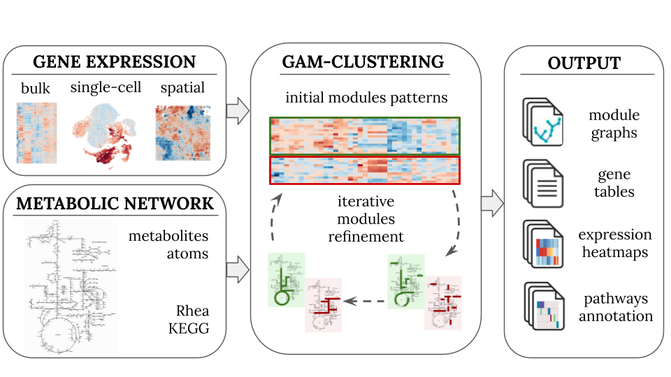

# GAM-clustering

`GAMclust` is an R package for identifying transcriptionally regulated metabolic 
modules in complex gene expression profiling datasets.

`GAMclust` implements a flexible data processing pipeline designed to analyze three
major types of gene expression data: bulk, single-cell, and spatial. 
The pipeline takes as an input a gene expression matrix and a global metabolic network.
After initial preprocessing, both of these inputs are integrated by the GAM-clustering 
algorithm, which identifies metabolic subnetworks (modules) with correlated gene 
expression behaviors. To aid in the interpretation of the results, several post-processing
procedures are carried out, including visualization and annotation of the modules.

Interactive results of GAM-clustering analysis of ImmGen Open Source and Tabula Muris 
data can be explored [here](http://artyomovlab.wustl.edu/immgen-met/), details are in 
[Gainullina et al, 2023](https://www.cell.com/cell-reports/fulltext/S2211-1247(23)00057-8).

## Installation

`GAMclust` package can be installed from GitHub:

```
remotes::install_github("alserglab/GAMclust")
```

## Usage

Examples of applying `GAMclust` to different type of data:

-   [bulk RNA-seq data tutorial](https://alserglab.github.io/GAMclust/articles/GAMclust_tutorial_BULK),
-   [single cell RNA-seq data tutorial](https://alserglab.github.io/GAMclust/articles/GAMclust_tutorial_SC),
-   [spatial RNA-seq data tutorial](https://alserglab.github.io/GAMclust/articles/GAMclust_tutorial_SPAT).


## Algorithm overview



GAMclust identifies coordinated metabolic modules by integrating gene co-expression
with the topology of the KEGG metabolic network. 
The algorithm first initializes $k$ representative expression patterns using k-means
($k = 32$ by default). Then scores for each gene $g_i$ against every pattern $c_j$ are calculated 
using the following formulas:

$$
d\left( g_{i}, c_{j} \right) = 1 - \mathrm{cor}\left( g_{i}, c_{j} \right);
$$

$$
d\left( g_{i}, c_{0} \right) \equiv \mathrm{base};
$$

$$
d'\left( g_{i}, c_{j} \right) = \min_{k \neq j,\; k \in (0, M)} \left( d\left( g_{i}, c_{k} \right) \right);
$$

$$
\mathrm{score}\left( g_{i}, c_{j} \right) = -\log\frac{d\left( g_{i}, c_{j} \right)}{d'\left( g_{i}, c_{j} \right)},
$$

where: 

- $g_{i}$ — expression of the $i$-th gene, $i \in (1, N)$;
- $c_{j}$ — pattern of the $j$-th cluster if $j \in (1, M)$ or special fake pattern if $j = 0$;
- $d$ — distance to the pattern the score is being calculated for;
- $d'$ — distance to the pattern which this gene has the most correlation with (all other patterns are considered except the pattern the score is being calculated for);
- $\mathrm{base}$ — distance to the fake pattern.

These scores are assigned as edge weights in the metabolic network, and for each 
expression pattern a maximum-weight connected subgraph (MWCS) is extracted,
yielding candidate metabolic modules. 
The patterns are then updated from the identified modules and the procedure is 
repeated until convergence.

See the [Algorithm description](https://alserglab.github.io/GAMclust/articles/Algorithm_description) for more details.
