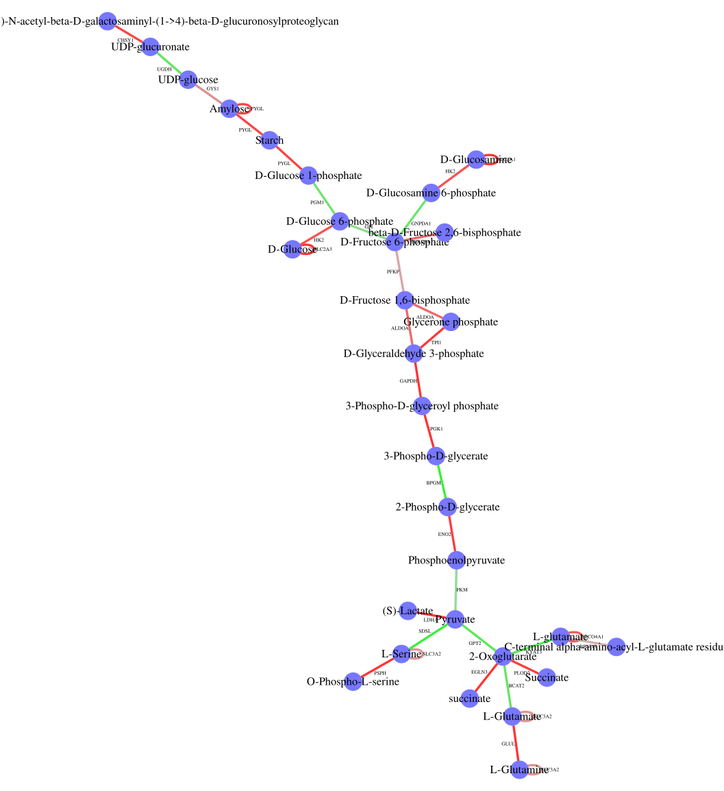
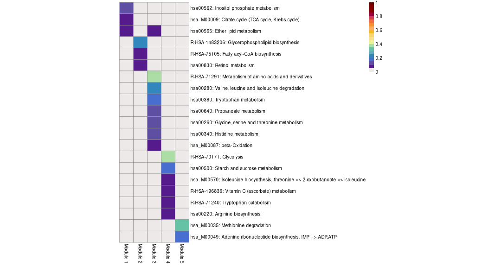

# GAM-clustering Tutorial Notebook For Spatial RNA-Seq Data

Install GAMclust package:

``` r

devtools::install_github("alserglab/GAMclust")
```

``` r

library(GAMclust)
library(gatom)
library(mwcsr)
library(fgsea)
library(data.table)
library(Seurat)
library(futile.logger)

set.seed(42)
```

``` r

startTime <- Sys.time()
```

### Preparing working environment

First, please load and initialize all objects required for
GAM-clustering analysis:

1.  load metabolic network and its metabolites annotation. We provide
    two networks: [KEGG](https://www.genome.jp/kegg/) and combined
    network that includes [KEGG](https://www.genome.jp/kegg/),
    [Rhea](https://www.rhea-db.org/) and transport reactions:

(1.1.) load [KEGG](https://www.genome.jp/kegg/) metabolic network
[`network.kegg.rds`](http://artyomovlab.wustl.edu/publications/supp_materials/GATOM/network.kegg.rds)
and its metabolites annotation
[`met.kegg.db.rds`](http://artyomovlab.wustl.edu/publications/supp_materials/GATOM/met.kegg.db.rds)

``` r

# KEGG network:
network <- readRDS(url("http://artyomovlab.wustl.edu/publications/supp_materials/GATOM/network.kegg.rds"))
metabolites.annotation <- readRDS(url("http://artyomovlab.wustl.edu/publications/supp_materials/GATOM/met.kegg.db.rds"))
```

(1.2.) or load combined metabolic network
[`network.combined.rds`](http://artyomovlab.wustl.edu/publications/supp_materials/GATOM/network.combined.rds),
its metabolites annotation
[`met.combined.db.rds`](http://artyomovlab.wustl.edu/publications/supp_materials/GATOM/met.combined.db.rds)
and species-specific list of genes that either come from proteome or are
not linked to a specific enzyme
[`gene2reaction.combined.mmu.eg.tsv`](http://artyomovlab.wustl.edu/publications/supp_materials/GATOM/gene2reaction.combined.mmu.eg.tsv)
for mouse and
[`gene2reaction.combined.hsa.eg.tsv`](http://artyomovlab.wustl.edu/publications/supp_materials/GATOM/gene2reaction.combined.hsa.eg.tsv)
for human data;

``` r

# combined network (KEGG+Rhea+transport reactions):
network <- readRDS(url("http://artyomovlab.wustl.edu/publications/supp_materials/GATOM/network.combined.rds"))
metabolites.annotation <- readRDS(url("http://artyomovlab.wustl.edu/publications/supp_materials/GATOM/met.combined.db.rds"))
gene2reaction.extra <- data.table::fread("http://artyomovlab.wustl.edu/publications/supp_materials/GATOM/gene2reaction.combined.hsa.eg.tsv", colClasses="character")
```

2.  load species-specific network annotation:
    [`org.Hs.eg.gatom.anno`](http://artyomovlab.wustl.edu/publications/supp_materials/GATOM/org.Hs.eg.gatom.anno.rds)
    for human data or
    [`org.Mm.eg.gatom.anno`](http://artyomovlab.wustl.edu/publications/supp_materials/GATOM/org.Mm.eg.gatom.anno.rds)
    for mouse data;

``` r

network.annotation <- readRDS(url("http://artyomovlab.wustl.edu/publications/supp_materials/GATOM/org.Hs.eg.gatom.anno.rds"))
```

3.  load provided list of metabolites that should not be considered
    during the analysis as connections between reactions (e.g., CO2,
    HCO3-, etc);

``` r

met.to.filter <- data.table::fread(system.file("mets2mask.lst", package="GAMclust"))$ID
```

4.  initialize SMGWCS solver:

(4.1.) we recommend to use here either heuristic relax-and-cut solver
`rnc_solver` from [`mwcsr`](https://github.com/ctlab/mwcsr) package,

``` r

solver <- mwcsr::rnc_solver()
```

(4.2.) either proprietary [CPLEX
solver](https://www.ibm.com/products/ilog-cplex-optimization-studio)
(free for academy);

``` r

cplex.dir <-  "/opt/ibm/ILOG/CPLEX_Studio1271"
```

``` r

solver <- mwcsr::virgo_solver(cplex_dir = cplex.dir)
```

5.  set working directory where the results will be saved to.

``` r

work.dir <- "results-spat"
dir.create(work.dir, showWarnings = F, recursive = T)
```

6.  TEMPORARY: collecting logs while developing the tool.

``` r

stats.dir <- file.path(work.dir, "stats")
dir.create(stats.dir, showWarnings = F, recursive = T)

setup_logger <- function(log.file.path, logger.name = "stats.logger") {
  file.appender <- appender.file(log.file.path)
  console.appender <- appender.console()
  combined.appender <- function(line) {
    file.appender(line)
    console.appender(line)
  }
  flog.appender(combined.appender, name = logger.name)
  flog.threshold(TRACE, name = logger.name)
}

log.file <- file.path(stats.dir, "log.txt")
setup_logger(log.file.path = log.file, logger.name = "stats.logger")
```

### Preparing objects for the analysis

#### Preparing data

GAMclust works with bulk, single cell and spatial RNA-seq data.

This vignette shows how to process spatial RNA-seq data.

Let’s load the data and take 10,000 genes for the GAM-clustering
analysis.

``` r

seurat_object <- readRDS(url("http://artyomovlab.wustl.edu/publications/supp_materials/GAMclust/275_T_ST_Seurat.rds"))

seurat_object <- Seurat::SCTransform(seurat_object, 
                                     assay = "Spatial", 
                                     variable.features.n = 10000,
                                     verbose = FALSE)

E <- as.matrix(Seurat::GetAssayData(object = seurat_object,
                                    assay = "SCT",
                                    layer = "scale.data"))

nrow(E) # ! make sure this value is in range from 6,000 to 12,000
```

    # [1] 10000

``` r

E[1:3, 1:3]
```

    #       AAACAAGTATCTCCCA-1 AAACACCAATAACTGC-1 AAACAGAGCGACTCCT-1
    # NOC2L          1.1571341          0.7969197          3.8411785
    # ISG15          2.5017305         -0.7729781          0.6169713
    # AGRN          -0.6511085         -0.7490492          0.5783016

Genes in your dataset may be named as Symbol, Entrez, Ensembl or RefSeq
IDs. One of these names should be specified as value of `gene.id.type`
parameter in
[`prepareData()`](https://github.com/alserglab/GAMclust/reference/prepareData.md).

If you analyse singe cell or spatial RNA-seq data, please set
`use.PCA=TRUE` in
[`prepareData()`](https://github.com/alserglab/GAMclust/reference/prepareData.md).

``` r

E.prep <- prepareData(E = E,
                      gene.id.type = "Symbol",
                      use.PCA = TRUE,
                      use.PCA.n = 50,
                      network.annotation = network.annotation)

E.prep[1:3, 1:3]
```

    #             PC1        PC2       PC3
    # 23480 -5.334666  1.1258589  3.269509
    # 6167   2.708519  1.7893544  2.947255
    # 60    -4.081374 -0.9354567 -1.662026

#### Preparing network

The
[`prepareNetwork()`](https://github.com/alserglab/GAMclust/reference/prepareNetwork.md)
function defines the structure of the final metabolic modules.

``` r

network.prep <- prepareNetwork(E = E.prep,
                               network = network,
                               topology = "metabolites",
                               met.to.filter = met.to.filter,
                               network.annotation = network.annotation,
                               gene2reaction.extra = gene2reaction.extra) # for combined network
```

    # INFO [2026-07-09 17:36:50] Global metabolite network contains 5813 edges.

    # INFO [2026-07-09 17:36:50] Largest connected component of this global network contains 1296 nodes and 4448 edges.

#### Preclustering

The
[`preClustering()`](https://github.com/alserglab/GAMclust/reference/preClustering.md)
function defines initial patterns using k-medoids clustering on gene
expression matrix. It is strongly recommended to do initial clustering
with no less than 32 clusters (`initial.number.of.clusters = 32`).

You can visualize the initial heatmap as shown below.

``` r

cur.centers <- preClustering(E.prep = E.prep,
                             network.prep = network.prep,
                             initial.number.of.clusters = 32,
                             network.annotation = network.annotation)
```

    # INFO [2026-07-09 17:36:50] 1001 metabolic genes from the analysed dataset mapped to this component.

``` r

cur.centers[1:3, 1:3]
```

    #          PC1        PC2       PC3
    # 1  0.6940166 -0.1461196 -0.971703
    # 2  3.1863111  1.2636034 -1.358610
    # 3 -0.4623664 -3.1075108 -1.622821

``` r

pheatmap::pheatmap(
      GAMclust:::normalize.rows(cur.centers),
      cluster_rows=F, cluster_cols=F,
      show_rownames=F, show_colnames=T)
```


### GAM-clustering analysis

Now you have everything prepared for the GAM-clustering analysis.

Initial patterns will be now refined in an iterative process. The output
of
[`gamClustering()`](https://github.com/alserglab/GAMclust/reference/gamClustering.md)
function presents a set of specific subnetworks (also called metabolic
modules) that reflect metabolic variability within a given
transcriptional dataset.

Note, that it may take a long time to derive metabolic modules by
[`gamClustering()`](https://github.com/alserglab/GAMclust/reference/gamClustering.md)
function (tens of minutes).

There is a set of parameters which determine the size and number of your
final modules. We recommend you to start with the default settings,
however you can adjust them based on your own preferences:

1.  If you consider final modules to bee too small or too big and it
    complicates interpretation for you, you can either increase or
    reduce by 10 units the `max.module.size` parameter.

2.  If among final modules you consider presence of any modules with too
    similar patterns, you can reduce by 0.1 units the `cor.threshold`
    parameter.

3.  If among final modules you consider presence of any uninformative
    modules, you can reduce by 10 times the `p.adj.val.threshold`
    parameter.

``` r

results <- gamClustering(E.prep = E.prep,
                         network.prep = network.prep,
                         cur.centers = cur.centers,
                         
                         start.base = 0.5,
                         base.dec = 0.05,
                         max.module.size = 50,

                         cor.threshold = 0.5,
                         p.adj.val.threshold = 1e-5,

                         batch.solver = seq_batch_solver(solver),
                         work.dir = work.dir,
                         
                         show.intermediate.clustering = FALSE,
                         verbose = FALSE,
                         collect.stats = TRUE)
```

### Visualizing and exploring the GAM-clustering results

Each metabolic module is a connected piece of metabolic network whose
genes expression is correlated across all dataset.

The following functions will help you to visualize and explore the
obtained results.

##### Get graphs of modules:

``` r

getGraphs(modules = results$modules,
          network.annotation = network.annotation,
          metabolites.annotation = metabolites.annotation,
          seed.for.layout = 42,
          work.dir = work.dir)
```

    # Graphs for module 1 are built

    # Graphs for module 2 are built

    # Graphs for module 3 are built

    # Graphs for module 4 are built

    # Graphs for module 5 are built

Example of the graph of the fourth module:



##### Get gene tables:

The table contains gene list. Each gene has two descriptive values: i)
gene’s correlation value with the modules pattern and ii) gene’s score.
High score means that this gene’s expression is similar to the module’s
pattern and not similar to other modules’ patterns.

``` r

m.gene.list <- getGeneTables(modules = results$modules,
                             nets = results$nets,
                             patterns = results$patterns.pos,
                             gene.exprs = E.prep,
                             network.annotation = network.annotation,
                             work.dir = work.dir)
```

    # Gene tables for module 1 are produced

    # Gene tables for module 2 are produced

    # Gene tables for module 3 are produced

    # Gene tables for module 4 are produced

    # Gene tables for module 5 are produced

Example of the gene table of the fourth module:

``` r

head(GAMclust:::read.tsv(file.path(work.dir, "m.4.genes.tsv"))) |>
  kableExtra::kable() |>
  kableExtra::kable_styling()
```

| symbol | Entrez |    score |       cor |
|:-------|-------:|---------:|----------:|
| SLC2A3 |   6515 | 3.332874 | 0.9552393 |
| SLC2A1 |   6513 | 2.693944 | 0.9334521 |
| EGLN3  | 112399 | 2.616592 | 0.9263654 |
| PGK1   |   5230 | 2.520763 | 0.9213604 |
| GLUL   |   2752 | 2.515743 | 0.9211180 |
| PSPH   |   5723 | 2.469190 | 0.9194949 |

##### Get plots of patterns:

``` r

for(i in 1:length(m.gene.list)){
 
  print(fgsea::plotCoregulationProfileSpatial(m.gene.list[[i]], 
                                             seurat_object,
                                             title = paste0("module ", i)))
}
```


##### Get plots of individual genes expression (example for the fourth module):

``` r

Seurat::DefaultAssay(seurat_object) <- "SCT"

i <- 4

Seurat::SpatialFeaturePlot(seurat_object, 
                           features = m.gene.list[[i]], 
                           pt.size.factor = 2, stroke = 0.01, alpha = 1,
                           image.alpha = 0,
                           ncol = 8)
```


##### Get tables and plots with annotation of modules:

Functional annotation of obtained modules is done based on KEGG and
Reactome canonical metabolic pathways.

``` r

getAnnotationTables(network.annotation = network.annotation,
                    nets = results$nets,
                    work.dir = work.dir)
```

    # Pathway annotation for module 1 is produced

    # Pathway annotation for module 2 is produced

    # Pathway annotation for module 3 is produced

    # Pathway annotation for module 4 is produced

    # Pathway annotation for module 5 is produced

Example of the annotation table of the fourth module:

``` r

head(GAMclust:::read.tsv(file.path(work.dir, "m.4.pathways.tsv"))) |>
  kableExtra::kable() |>
  kableExtra::kable_styling(font_size = 8) |>
  kableExtra::column_spec(1, width = "1.6in") |>
  kableExtra::column_spec(2:6, width = "0.5in") |>
  kableExtra::column_spec(7, width = "1.2in")
```

| pathway | pval | padj | foldEnrichment | overlap | size | overlapGenes |
|:---|---:|---:|---:|---:|---:|:---|
| R-HSA-70171: Glycolysis | 0.0000000 | 0.0000000 | 16.913151 | 12 | 13 | GNPDA1 ENO2 ALDOA GAPDH GPI HK2 PFKFB4 PFKP PGK1 PKM BPGM TPI1 |
| hsa00500: Starch and sucrose metabolism | 0.0000727 | 0.0043248 | 9.161290 | 5 | 10 | GPI GYS1 HK2 PGM1 PYGL |
| hsa_M00570: Isoleucine biosynthesis, threonine =\> 2-oxobutanoate =\> isoleucine | 0.0028877 | 0.0916362 | 18.322581 | 2 | 2 | SDSL BCAT2 |
| R-HSA-196836: Vitamin C (ascorbate) metabolism | 0.0083672 | 0.1896560 | 12.215054 | 2 | 3 | SLC2A1 SLC2A3 |
| R-HSA-71240: Tryptophan catabolism | 0.0161645 | 0.3205964 | 9.161290 | 2 | 4 | KYAT3 SLC3A2 |
| hsa00220: Arginine biosynthesis | 0.0377188 | 0.6191088 | 6.107527 | 2 | 6 | GLUL GPT2 |

Annotation heatmap for all modules:

``` r

getAnnotationHeatmap(work.dir = work.dir)
```

    # Processing module 1

    # Module size: 43

    # Processing module 2

    # Module size: 42

    # Processing module 3

    # Module size: 34

    # Processing module 4

    # Module size: 31

    # Processing module 5

    # Module size: 6



##### Compare modules obtained in different runs:

You may also compare two results of running GAM-clustering on the same
dataset (e.g. runs with different parameters) or compare two results of
running GAM-clustering on different datasets (then set
`same.data=FALSE`).

``` r

modulesSimilarity(dir1 = work.dir,
                  dir2 = "old_dir",
                  name1 = "new",
                  name2 = "old",
                  same.data = TRUE,
                  use.genes.with.pos.score = TRUE,
                  work.dir = work.dir,
                  file.name = "comparison.png")
```

### Session info

Elapsed time: 32.4 mins.

Peak R memory usage: 4.0 GB

``` r

sessionInfo()
```

    # R version 4.5.3 (2026-03-11)
    # Platform: x86_64-pc-linux-gnu
    # Running under: Debian GNU/Linux 13 (trixie)
    # 
    # Matrix products: default
    # BLAS:   /usr/lib/x86_64-linux-gnu/openblas-pthread/libblas.so.3 
    # LAPACK: /usr/lib/x86_64-linux-gnu/openblas-pthread/libopenblasp-r0.3.29.so;  LAPACK version 3.12.0
    # 
    # locale:
    #  [1] LC_CTYPE=C.utf8       LC_NUMERIC=C          LC_TIME=C            
    #  [4] LC_COLLATE=C.utf8     LC_MONETARY=C.utf8    LC_MESSAGES=C.utf8   
    #  [7] LC_PAPER=C.utf8       LC_NAME=C             LC_ADDRESS=C         
    # [10] LC_TELEPHONE=C        LC_MEASUREMENT=C.utf8 LC_IDENTIFICATION=C  
    # 
    # time zone: America/Chicago
    # tzcode source: system (glibc)
    # 
    # attached base packages:
    # [1] stats     graphics  grDevices utils     datasets  methods   base     
    # 
    # other attached packages:
    #  [1] future_1.70.0       futile.logger_1.4.9 Seurat_5.5.0       
    #  [4] SeuratObject_5.4.0  sp_2.2-1            fgsea_1.37.4       
    #  [7] mwcsr_0.1.12        gatom_1.8.4         GAMclust_0.1.0     
    # [10] data.table_1.18.4   rmarkdown_2.31     
    # 
    # loaded via a namespace (and not attached):
    #   [1] RcppAnnoy_0.0.23            splines_4.5.3              
    #   [3] later_1.4.8                 tibble_3.3.1               
    #   [5] polyclip_1.10-7             graph_1.88.1               
    #   [7] XML_3.99-0.23               fastDummies_1.7.6          
    #   [9] lifecycle_1.0.5             globals_0.19.1             
    #  [11] lattice_0.22-7              MASS_7.3-65                
    #  [13] magrittr_2.0.5              plotly_4.12.0              
    #  [15] httpuv_1.6.17               otel_0.2.0                 
    #  [17] glmGamPoi_1.22.0            sctransform_0.4.3          
    #  [19] spam_2.11-3                 spatstat.sparse_3.1-0      
    #  [21] reticulate_1.46.0           cowplot_1.2.0              
    #  [23] pbapply_1.7-4               DBI_1.3.0                  
    #  [25] RColorBrewer_1.1-3          abind_1.4-8                
    #  [27] Rtsne_0.17                  GenomicRanges_1.62.1       
    #  [29] purrr_1.2.2                 BiocGenerics_0.56.0        
    #  [31] IRanges_2.44.0              S4Vectors_0.48.1           
    #  [33] ggrepel_0.9.8               irlba_2.3.7                
    #  [35] listenv_0.10.1              spatstat.utils_3.2-3       
    #  [37] pheatmap_1.0.13             goftest_1.2-3              
    #  [39] RSpectra_0.16-2             spatstat.random_3.4-5      
    #  [41] fitdistrplus_1.2-6          parallelly_1.47.0          
    #  [43] svglite_2.2.2               DelayedMatrixStats_1.32.0  
    #  [45] codetools_0.2-20            DelayedArray_0.36.1        
    #  [47] xml2_1.5.2                  tidyselect_1.2.1           
    #  [49] farver_2.1.2                shinyCyJS_1.0.0            
    #  [51] matrixStats_1.5.0           stats4_4.5.3               
    #  [53] spatstat.explore_3.8-0      Seqinfo_1.0.0              
    #  [55] jsonlite_2.0.0              progressr_0.19.0           
    #  [57] ggridges_0.5.7              survival_3.8-3             
    #  [59] systemfonts_1.3.1           tools_4.5.3                
    #  [61] ica_1.0-3                   Rcpp_1.1.1-1.1             
    #  [63] glue_1.8.1                  gridExtra_2.3              
    #  [65] SparseArray_1.10.10         xfun_0.57                  
    #  [67] MatrixGenerics_1.22.0       dplyr_1.2.1                
    #  [69] withr_3.0.2                 formatR_1.14               
    #  [71] fastmap_1.2.0               GGally_2.4.0               
    #  [73] digest_0.6.39               R6_2.6.1                   
    #  [75] mime_0.13                   textshaping_1.0.4          
    #  [77] scattermore_1.2             rsvg_2.7.0                 
    #  [79] tensor_1.5.1                spatstat.data_3.1-9        
    #  [81] RSQLite_3.52.0              tidyr_1.3.2                
    #  [83] generics_0.1.4              httr_1.4.8                 
    #  [85] htmlwidgets_1.6.4           S4Arrays_1.10.1            
    #  [87] ggstats_0.13.0              uwot_0.2.4                 
    #  [89] pkgconfig_2.0.3             gtable_0.3.6               
    #  [91] blob_1.3.0                  lmtest_0.9-40              
    #  [93] S7_0.2.2                    XVector_0.50.0             
    #  [95] htmltools_0.5.9             dotCall64_1.2              
    #  [97] BioNet_1.70.0               scales_1.4.0               
    #  [99] kableExtra_1.4.0            Biobase_2.70.0             
    # [101] png_0.1-9                   spatstat.univar_3.1-7      
    # [103] knitr_1.51                  lambda.r_1.2.4             
    # [105] rstudioapi_0.17.1           reshape2_1.4.5             
    # [107] nlme_3.1-168                cachem_1.1.0               
    # [109] zoo_1.8-15                  stringr_1.6.0              
    # [111] KernSmooth_2.23-26          parallel_4.5.3             
    # [113] miniUI_0.1.2                AnnotationDbi_1.72.0       
    # [115] pillar_1.11.1               grid_4.5.3                 
    # [117] vctrs_0.7.3                 RANN_2.6.2                 
    # [119] promises_1.5.0              beachmat_2.26.0            
    # [121] xtable_1.8-8                cluster_2.1.8.1            
    # [123] Rgraphviz_2.54.0            evaluate_1.0.5             
    # [125] cli_3.6.6                   compiler_4.5.3             
    # [127] futile.options_1.0.1        rlang_1.2.0                
    # [129] crayon_1.5.3                future.apply_1.20.2        
    # [131] labeling_0.4.3              plyr_1.8.9                 
    # [133] stringi_1.8.7               viridisLite_0.4.3          
    # [135] deldir_2.0-4                BiocParallel_1.44.0        
    # [137] Biostrings_2.78.0           lazyeval_0.2.3             
    # [139] spatstat.geom_3.7-3         Matrix_1.7-4               
    # [141] RcppHNSW_0.6.0              patchwork_1.3.2            
    # [143] sparseMatrixStats_1.22.0    bit64_4.8.0                
    # [145] ggplot2_4.0.3               KEGGREST_1.53.4            
    # [147] shiny_1.13.0                SummarizedExperiment_1.40.0
    # [149] ROCR_1.0-12                 igraph_2.3.2               
    # [151] memoise_2.0.1               fastmatch_1.1-8            
    # [153] bit_4.6.0
